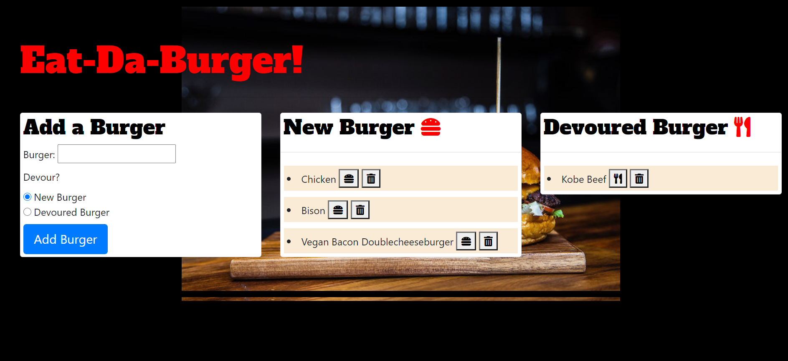

# Eat-Da_Burger
  
  ## Table of Contents
  * [Description](#Description)
  * [Installation](#Installation)
  * [Usage](#Usage)
  * [License](#License)
  * [Tests](#Tests)
  * [Questions](#Questions)
  ## Description
  Eat-Da_Burger is an app that uses mysql, handlebars, express, javascript, bootstrap, and css, and node.js. The purpose of the app is to allow the user to log burgers they have eaten and burgers they will eat. It is written using the MVC pattern. For more information on MVC architecture, please visit : https://docs.microsoft.com/en-us/aspnet/core/mvc/overview?view=aspnetcore-5.0.

  The buttons are designed with font awesome graphics. The fonts are from google fonts.
  
  
  ## Installation
  The app is deployed at heroku :
  ## Usage Information
  In the field burgers, enter a kind of burger and log it to the card for new burgers or devoured burgers. When a new burger has been devoured, use the button next to the burger name to change its category to devoured. When a devoured burger has been enjoyed so much that it DEMANDS a second portion, use the button next to its name to redeploy the burger to new burgers so it can be devoured again. In the unfortunate event a burger is sub satisfactory, use the trash button to destroy the burger from the lists.
  ## License
  Copyright (c) Microsoft Corporation. All rights reserved.
  
  Licensed under the MIT license.
  ## Tests
  Open the app on heroku and attempt to log burgers.
  ## Questions
  If you have any further questions, please contact me at jwheele1@gmail.com.
  My GitHub profile is [Github Repo](https://github.com/jrtwheeler).
